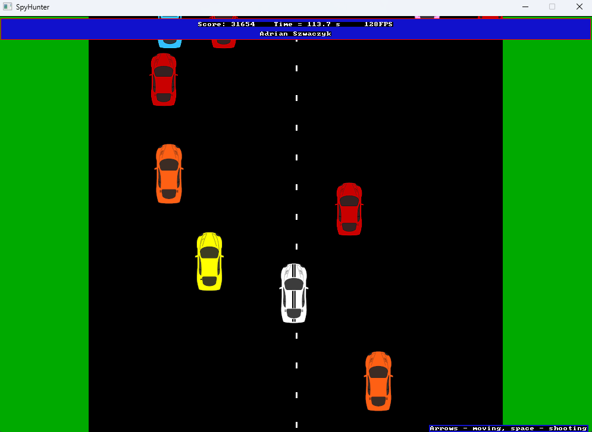
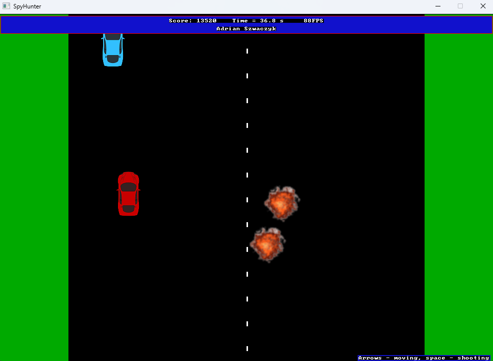

# SDL Racing Shooter Game

## Overview
This is a 2D racing and shooting game built using C++ and SDL. The game features a player-controlled vehicle that can move, accelerate, and shoot bullets at enemy NPC cars while avoiding collisions. The game runs in a loop until the player starts a new game or quits.

## Features
- **Player Vehicle**: Can move, accelerate, and shoot bullets.
- **NPC Vehicles**: Randomly spawn on the road, with red ones being enemies.
- **Collision Detection**: Detects collisions between the player and NPCs, as well as bullets hitting enemies.
- **Explosions & Respawn**: Player and NPCs explode on collision or destruction and can respawn.
- **Game Loop & State Management**: The game updates continuously until the player quits.
- **Pause & Fullscreen Toggle**: The game can be paused or switched to fullscreen mode.

## Controls
- **Arrow Keys**: Move the player vehicle.
- **Spacebar**: Shoot bullets.
- **P**: Pause/unpause the game.
- **N**: Start a new game.
- **Escape**: Quit the game.
- **F11**: Toggle fullscreen mode.

## Installation & Setup
### Prerequisites
- SDL2 and SDL_image are included in repo.
- Visual Studio.

### Compilation and running the game
Compile and run the game by opening project file in Visual Studio and running main.cpp file in x86 architecture.
